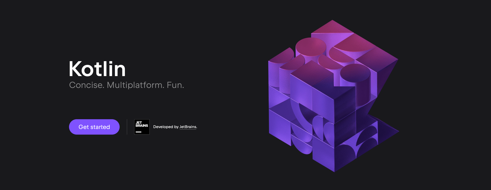
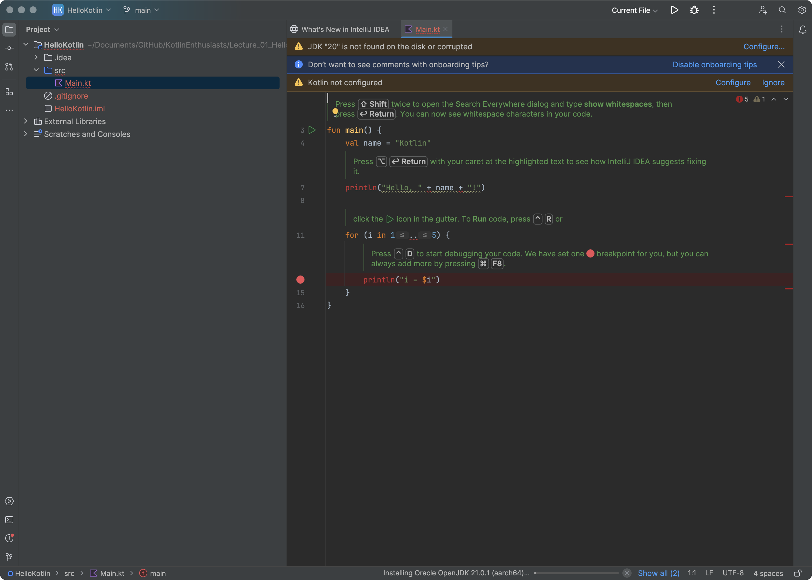
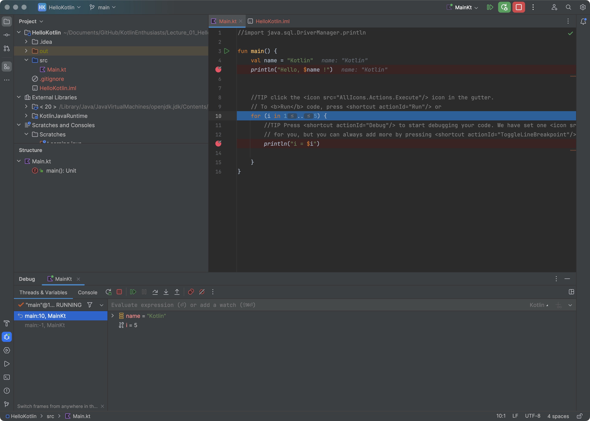
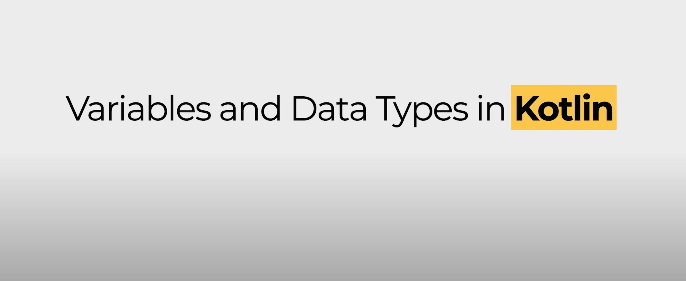

# KotlinEnthusiasts
Practice Kotlin skill stack for Android development


# Learing source
[Kotlin Programming Full Tutorial 2023 | 4+ Hours Android App Development Project & Course | @SCALER](https://www.youtube.com/watch?v=0MdkXBssRRg)


## Chapter 1&2. Introduction to Kotlin and development environment construction

[Kotin offcial website](https://kotlinlang.org)

<details>
  <summary>Details</summary>

  `2023-12-13 00:23:08`

  Step 1. Download IntelliJ IDE for Mac
  

  Step 2. Install IntelliJ IDE on Mac
  

  Step 3. Open and create a Kotlin project
  

  Step 4. Fix some issues and follow the tips provided by IntelliJ
  

  Step 5. Try some other use cases
  

</details>


## Chapter 3. Variables and Data Types in Kotlin



<details>
  <summary>Details</summary>

```
  - var vs val
  - data types
  - give the data type
  - operators

  - print vs println

  - ++a / a++

  - print(a++)
  - print(a)


  - print(++a)
  - print(a)

  - print(++a++)
  - print(a)
  ```
</details>

```
Reorganize the repository.
Do some smalle things you can control.
2024-01-04 00:59:18
```


