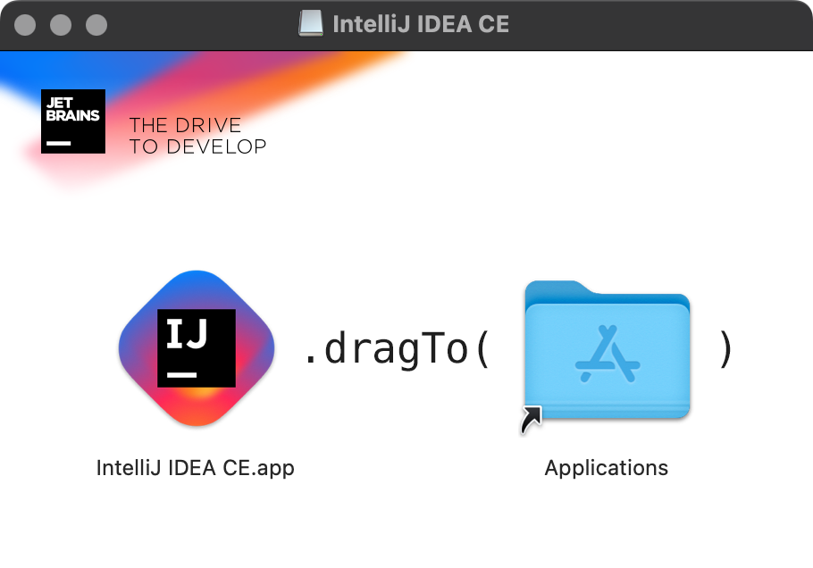
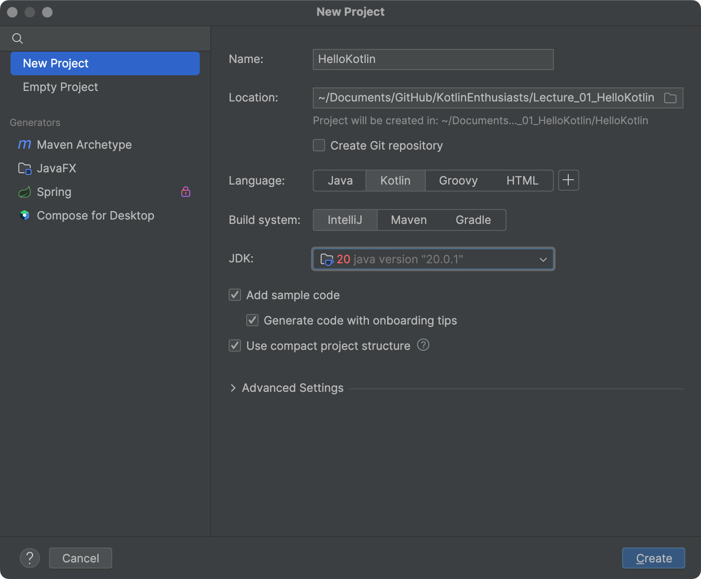
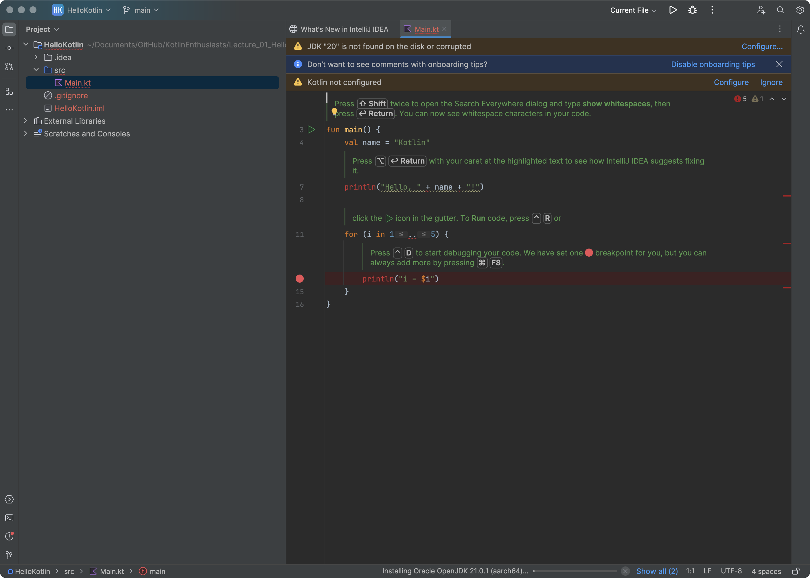

# KotlinEnthusiasts
Practice Kotlin skill stack for Android development

# Learing source
[Kotlin Programming Full Tutorial 2023 | 4+ Hours Android App Development Project & Course | @SCALER](https://www.youtube.com/watch?v=0MdkXBssRRg)

## Lecture 1. Kotlin introduction and set up the devlopment environment
- `2023-12-13 00:23:08`

- Download IntelliJ for Mac

- Install IntelliJ on Mac

- Open and create a Kotlin project

- Fix some issues and follow the tips provided IntelliJ

- Try some use cases

