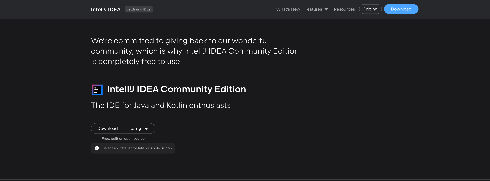
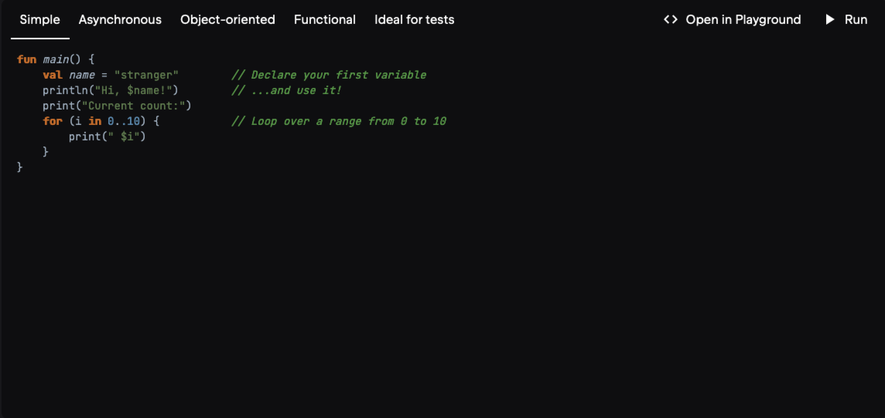

# Kotlin Enthusiasts
Practice Kotlin skill stack for Android development


## Learing source
- [Kotlin Programming Full Tutorial 2023 | 4+ Hours Android App Development Project & Course | @SCALER](https://www.youtube.com/watch?v=0MdkXBssRRg)
- [Kotlin Official Docs](https://kotlinlang.org/docs/home.html)

## Chapter 1 - Get started with Kotlin

[Kotlin offcial website](https://kotlinlang.org)

<details>
  <summary>Details</summary>

  Step 1. Download IntelliJ IDE for Mac
  

  Step 2. Install IntelliJ IDE on Mac
  

  Step 3. Open and create a Kotlin project
  

  Step 4. Fix some issues and follow the tips provided by IntelliJ
  

  Step 5. Try some other use cases
  

</details>


## Chapter 2 - Basic syntax practice


In this part, I recommend following the Kotlin official tutorial [Learn Kotlin by Example](https://play.kotlinlang.org/byExample/01_introduction/01_Hello%20world) to practice.
<details>
  <summary>Details</summary>

  - Introduction
    - [Hello World](https://play.kotlinlang.org/byExample/01_introduction/01_Hello%20world)
    - [Functions](https://play.kotlinlang.org/byExample/01_introduction/02_Functions)
    - [Variables](https://play.kotlinlang.org/byExample/01_introduction/03_Variables)
    - [Null Safety](https://play.kotlinlang.org/byExample/01_introduction/04_Null%20Safety)

</details>

```
Reorganize the repository.
Do some smalle things you can control.
2024-01-04 00:59:18
```


