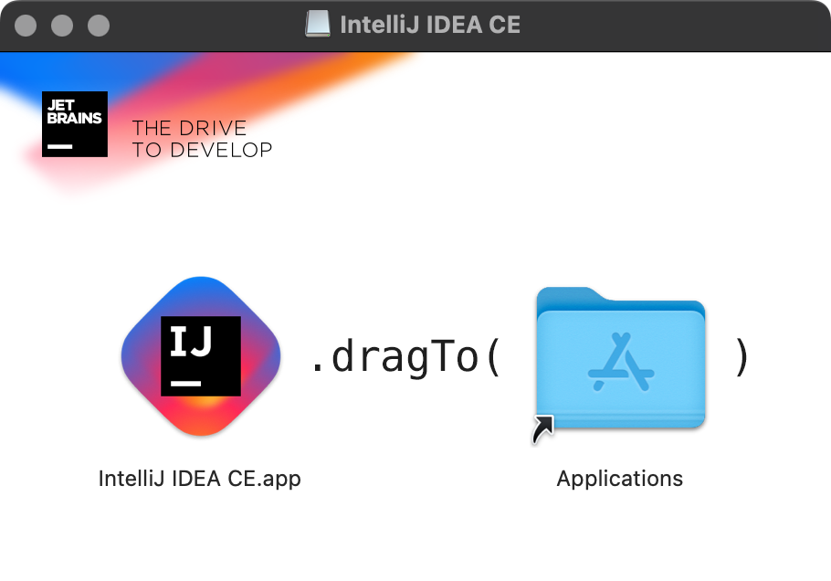
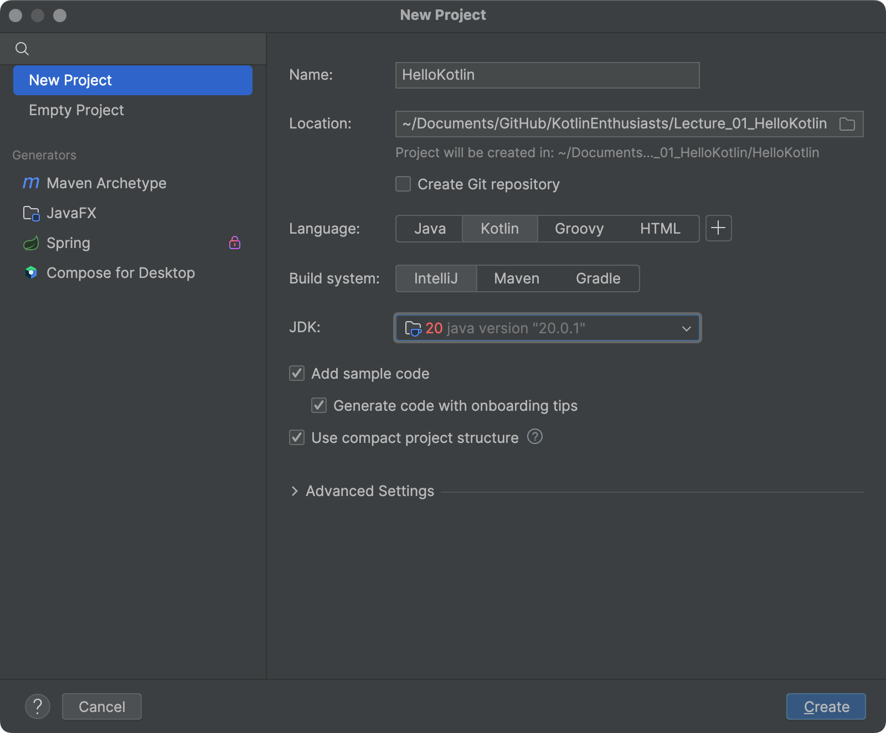
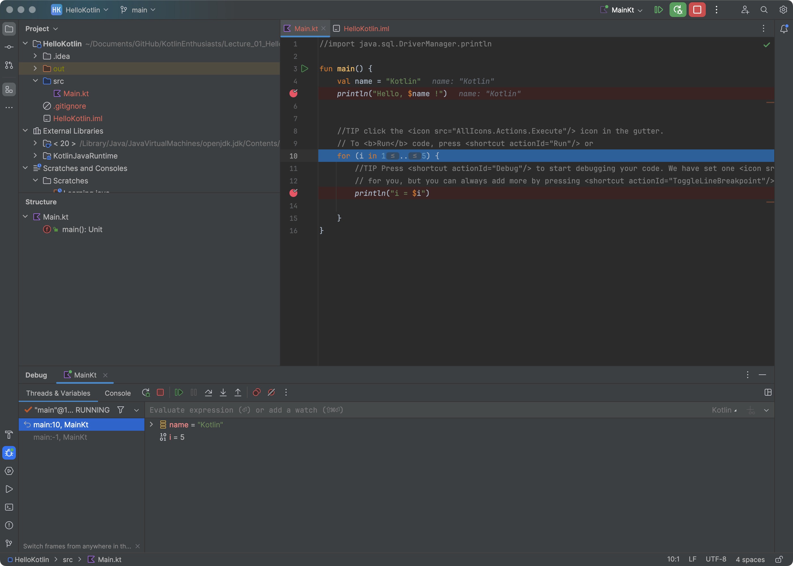
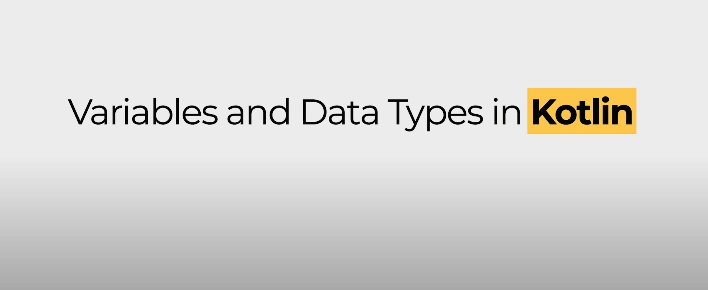

# KotlinEnthusiasts
Practice Kotlin skill stack for Android development

# Learing source
[Kotlin Programming Full Tutorial 2023 | 4+ Hours Android App Development Project & Course | @SCALER](https://www.youtube.com/watch?v=0MdkXBssRRg)

## Chapter 1&2. Introduction to Kotlin and development environment construction
- `2023-12-13 00:23:08`

- Download IntelliJ for Mac

- Install IntelliJ on Mac

- Open and create a Kotlin project

- Fix some issues and follow the tips provided IntelliJ

- Try some use cases

## Chapter 3. Variables and Data Types in Kotlin

- var vs val
- data types
    - give the data type
- operators

- print vs println

- ++a / a++

- print(a++)
- print(a)

- print(++a)
- print(a)

- print(++a++)
- print(a)